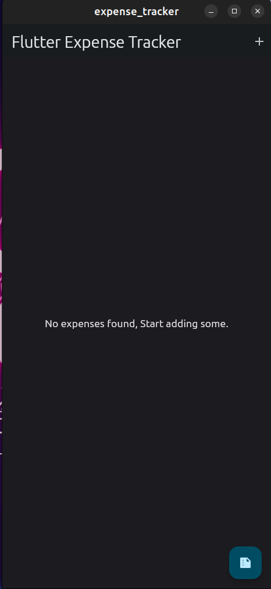

# Flutter Expense Tracker

A minimalistic expense tracking app built using Flutter Framework

 

## Installation

To install this app in your local system,first clone the repository.

```bash
  git clone [repository_link]
  cd [project_name]
  flutter pub get
```

## ScreenShots

  

## Technologies Used

- Flutter for UI
- Bloc for State Management
- Shared Preferencs to make the expense items persist
